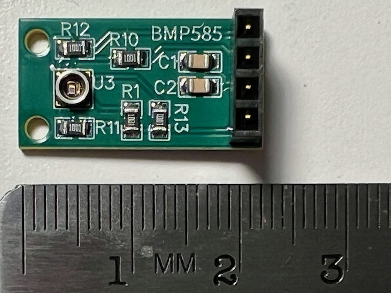
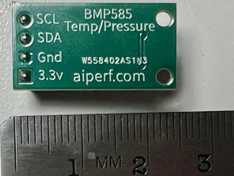
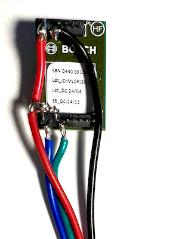
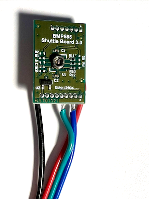

# Micropython BMPxxx - BMP585, BMP581, BMP380, and BMP280 driver
MicroPython Driver for the Bosch BMP585, BMP581, BMP390, and BMP280  pressure sensors using I2C. It has the ability to adjust sea level pressure and/or the sensors altitude at a known elevation for accurate future tracking. Raspberry Pi Pico and Pico 2.

## Driver Features with focus on BMP585 & BMP581 Sensors
Code includes:
* BMP585, BMP581, BMP390, and BMP280 sensors are supported.
* I2C only (possible future additions may include SDI).
  * checks i2c primary address and if not present it then checks secondary (see table 1 below for each sensor's addresses).
* All pressures are in hPA.
* All temperatures are in Celsius.
* Code enables setting Pressure/Temperature OverSampling and IIR values.
* Altitude is calculated using the difference between sensor's current pressure and sea level pressure setting.
* One can adjusting sea level pressure setting to known local measurements.
  * For sea level pressure, the driver defaults to 1013.25 hpa which is the international accepted world-wide average hPa. However you should know that weather causes sea level presssure to vary significantly (typ: 990 hPa to 1040 hPA).
  * It is recommended to set the current sea level pressure on each use to that of the nearest airport, for example: https://www.weather.gov/wrh/timeseries?site=KPDX
  * Your local sea level pressure is NOT the pressure at your sensor, it is pressure that would be measured if your altitude was sea level.
  * Altitude measurements will be inaccurate by over 1000' (500m) depending on the weather, if you do not set sea level to the nearest local known sea level pressure at the current time.
  * Altitude calcuLations in this code use NSF's NCAR formula: https://ncar.github.io/aircraft_ProcessingAlgorithms/www/PressureAltitude.pdf
* Various error checks are coded throughout the driver.

Buy the amazing but hard-to-find BMP585 sensor here: https://www.tindie.com/products/brad_aiperf/bmp585-high-accuracy-pressure-sensor-33v-board/ or you can get the $30 Bosch shuttle board and hack it as described below.

## Getting Started - Installing
This driver has three required files: __init__.py, bmpxxx.py, and i2c_helpers.py. All three must be copied to the board (/ or /lib) in order for it to work. We find it best to have them in a directory [micropython_bmpxxx](micropython_bmpxxx). Next, try some of the provided [examples](examples).

## Sample Usage
Required Imports:
```
from machine import Pin, I2C
from micropython_bmpxxx import bmpxxx
```
If you have BMP581, define your machine.I2C object using I2C 1:
```
i2c = I2C(1, sda=Pin(2), scl=Pin(3))
bmp = bmpxxx.BMP581(i2c)
```
Or, If if you have a different sensor specify the appropriate one, below we show for BMP390, supported sensor (BMP585, BMP581, BMP390, BMP280):
```
i2c = I2C(1, sda=Pin(2), scl=Pin(3))
bmp = bmpxxx.BMP390(i2c)
```
Getting pressure, temperature, and altitude from the sensor:
```
press = bmp.pressure
temp = bmp.temperature

# altitude in meters is based on sea level pressure of 1013.25 hPA
meters = bmp.altitude
print(f"alt = {meters:.2f} meters")
```
To improve the accuracy of the Altitude, it is best to explicity set the set sea level pressure to a known sea level pressure in hPa at nearest airport, for exmaple:
https://www.weather.gov/wrh/timeseries?site=KPDX:
```
bmp.sea_level_pressure = 1010.80
meters = bmp.altitude
print(f"alt = {meters:.2f} meters")
```
Increase BMP585/BMP581 sensor to highest resolution using oversampling. Each sensor has different allowable values:
```
# Highest resolution for BMP585 & BMP581, often we also set IIR to smooth out noise
bmp.pressure_oversample_rate = bmp.OSR128
bmp.temperature_oversample_rate = bmp.OSR8
bmp.iir_coefficient = bmp.COEF_7
```
Below are other settings you can adjust on the sensor, see data sheet for more info:
```
print("Current power mode setting: ", bmp.power_mode)
for power_mode in bmp.power_mode_values:
    bmp.power_mode = power_mode
    print(f"New Power mode setting: {bmp.power_mode}")

print(f"Current Output data rate setting: ", bmp.output_data_rate)
for output_data_rate in range(0, 32, 1):
    bmp.output_data_rate = output_data_rate
    print(f"New data rate setting: {bmp.output_data_rate}")

print("Current IIR setting: ", bmp.iir_coefficient)
for iir_coef in bmp.iir_coefficient_values:
    bmp.iir_coefficient = iir_coef
    print(f"New IRR setting: {bmp.iir_coefficient}")
```
## I2C Addresses
If you only have one sensor on the same I2C, they it will use the table below to scan the addresses. If you have multiple devices on the same I2C it is a good practice to specify the sensors address. To change the address to secondary you need to look look up the specs of your specific sensor. Often addresses can be changed with a solder blob or by connecting specific pins on the sensor to ground or vcc. This driver will scan for both the primary and secondary addresses. It then checks each sensors unique id to see if it is one of these bmp sensors.

Table 1: I2C Sensor Address
| Sensor | Default | Secondary | 
| :---:  | :---:| :---: |
| BMP585 | 0x47 | 0x46  | 
| BMP581 | 0x47 | 0x46  | 
| BMP390 | 0x7f | 0x7e  | 
| BMP280 | 0x77 | 0x76  | 

The following code is useful when scanning for device addresses on I2C. I always put this in my code when bringing up new sensor. Also if device not found triple-check all wiring.
```
# Notice this is using i2c1 not i2c0(typically used for REPL)
i2c = I2C(id=1, scl=Pin(27), sda=Pin(26))
i2c1_devices = i2c.scan()
if i2c1_devices:
    for d in i2c1_devices: print(f"i2c1 device at address: {hex(d)}")
else:
    print("ERROR: No i2c1 devices")
```
Example of specifying an address for a BMP581:
```
bmp = bmpxxx.BMP581(i2c=i2c, address=0x47)
```
## Recommended Oversampling Rates to Improve Sensors' Accuracy
The table 2 below is Bosch's recommended oversampling pressure and temperature settings for BMP585 and BMP581. Higher sampling rates effect the refresh rate and the power consumption. Please checked the Bosch datasheets for more information https://www.bosch-sensortec.com/products/environmental-sensors/pressure-sensors/

Table 2: BMP585/BMP581 Recommendations from Bosch
| Oversampling setting | OSR Pressure | Pressure<br /> Oversampling | Temperature<br /> Oversampling | IIR |
| :--- | :---: | :---: | :---: | :---: |
| Lowest Power |  000     | x1     | x1     | COEF_0 |
| |  001  | x2     | x1     |COEF_0 |
| Standard resolution |  010     | x4     | x1     | COEF_3 |
| |  011  | x8     | x1     | COEF_3 |
| High resolution    |  100     | x16     | x1     | COEF_3 |
| |  101  | x32     | x2     | COEF_3 |
| |  110  | x64     | x4     | COEF_3 |
| Highest resolution |  111     | x128     | x8     | COEF_7 |

```
# Highest recommended for combined pressure and temperature for BMP581 or BMP585 sensor
bmp.pressure_oversample_rate = bmp.OSR128
bmp.temperature_oversample_rate = bmp.OSR8
bmp.iir_coefficient = bmp.COEF_7
```
The BMP585 and BMP581 do not have recommended IIR filters to go with the table above.

The table 3 below is Bosch's recommended oversampling pressure and temperature settings for bmp390. There are recommended IIR filter settings for the bmp390 in section 3.5. Filter section, page 17, in bmp390 datasheet

Table 3: BMP390 Recommendations from Bosch
| Oversampling setting | OSR Pressure | Pressure<br /> Oversampling | Temperature<br /> Oversampling | IIR | Sample Use |
| :-------------------- |:---:|:---:|:---:|:---:|:--- |
| Ultra low power       | 000 | x1  | x1  | COEF_0 | Weather monitoring<br />lowest power, iif off|
| Low power             | 001 | x2  | x1  | COEF_0 | Drop detecton, iir off |
| Standard resolution   | 010 | x4  | x1  | COEF_3 | Handheld dynamic|
| High resolution       | 011 | x8  | x1  | COEF_1 | Drone,<br />low power|
| Ultra high resolution | 100 | x16 | x2  | COEF_3 | Indoor navigation|

```
# Highest recommended for combined pressure and temperature for bmp390 sensor
# below are recommended for Indoor Navigation on bmp390 (page 17 of bmp390 datasheet)
bmp.pressure_oversample_rate = bmp.OSR16
bmp.temperature_oversample_rate = bmp.OSR2
bmp.iir_coefficient = bmp.COEF_3
```
bmp.OSR1 corresponds to x1 for all sensors, bmp.OSR2 corresponds to x2 for all sensors, bmp.OSR4 corresponds to x4 for all sensors, etc. If you go over for a particular sensor, then an error message will show possible values.

## Example projects using this Driver
* Digital altimeter: https://github.com/bradcar/digital-altimeter-rp2

## Bosch Sensors Compared
* Bosch BMP585, MEMS-based barometric pressure sensor, perf similar to BMP581, released 2023.
  * Liquid resistant due to gel sensor
  * The BMP585 accuracy similar to Bosch’s existing BMP581.
    * Measure change in height of just a few centimeters. 
    * Relative accuracy of +/-0.06 hPa and typical absolute accuracy of +/-0.5 hPa.
* The BMP581, capacitive-based barometric pressure sensor, released 2022. 
  * The BMP581 accuracy similar to Bosch’s existing BMP585.
    * Measure change in height of just a few centimeters. 
    * Relative accuracy of +/-0.06 hPa and typical absolute accuracy of +/-0.3 hPa.
  * the BMP581 vs. BMP390: draws 85% less current, noise is 80% lower, and temperature coefficient offset is reduced by 33%.
* Bosch BMP390, previous generation, released 2021.
  * Relative accuracy of +/-0.03 hPa and typical absolute accuracy of +/-0.5 hPa.
  * Measure change in height of 0.25 meters.
* Bosch BMP280, old generation, released 2015.
  * Relative accuracy of +/-0.12 hPa and typical absolute accuracy of +/-1.0 hPa.
  * Measure change in height of+/-1 meter.

Bosch video showing using BMP585 underwater (the Bosch shuttle board won't work underwater :) ):
* https://www.youtube.com/watch?v=BaAhb2vaAQg

## License Information
This software product is open source. Please review the LICENSE.md file for license information.
* distributed as-is; no warranty is given.
 
## Credits
Code based on great work by Jose & Scott!
* micropython_bmp581 Author: Jose D. Montoya, jposada202020
  * github:jposada202020/MicroPython_bmp581
  * Corrected error in altitude calculation, also removed code that limits accuracy to 100 cm instead of allowing 1cm.
* Also based on
  * adafruit_register.i2c_struct, adafruit_register.i2c_bits.  Author: Scott Shawcroft

## Todos
* Open Question: IIR code for BMP585 & BMP581 uses the same IIR for pressure and temperature, this simplifies control and is like the bmp280 & bmp390 sensors, but this decision takes away flexibility for these newer sensors. 

## My custom BMP585 Board
I wanted a small BMP585 sensor board (I2C), so I designed my own. One can apply waterproofing to this board for underwater pressure sensing. It is only 16.1 mm * 12 mm. Getting the amazing but hard-to-find BMP585 sensor: https://www.tindie.com/products/brad_aiperf/bmp585-high-accuracy-pressure-sensor-33v-board/ 





## Hacked Bosch BMP585 Shuttle Board
Bosch makes the BMP585 shuttle board, but it must be wired as below to use the I2C interface with Raspberry Pi. Shuttleboard pin details: https://www.electroniclinic.com/bosch-bmp585-barometric-pressure-sensor-with-arduino/
* 1.27mm pins not breadboard friendly (boardboards use 2.54mm)
* 3.3v:
  * vdd to 3.3v (pin 1 of 7 pin connector)
  * vddio to 3.3v (pin 2 of 7 pin connector)
* gnd:
  * wire gnd to ground (pins 3 of 7 pin connector)
* CS for I2C mode:
  * wire to 3.3v (pin 1 of 9 pin connector)
* SCK/SCL: I2C SCL (pin 2 of 9 pin connector)
* SDO for I2C mode:
  * wire to 3.3v  (pin 3 of 9 pin connector)
* SDI/SDA: I2C SDA (pin 4 of 9 pin connector)

Images of my quick hack to shuttle board:




Additional info: https://www.aiperf.com/raspberry-pi/bmp585.html
